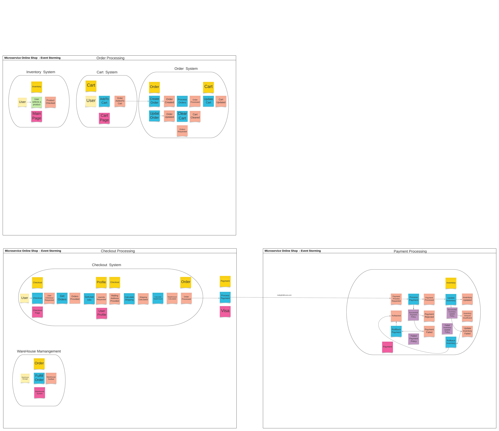
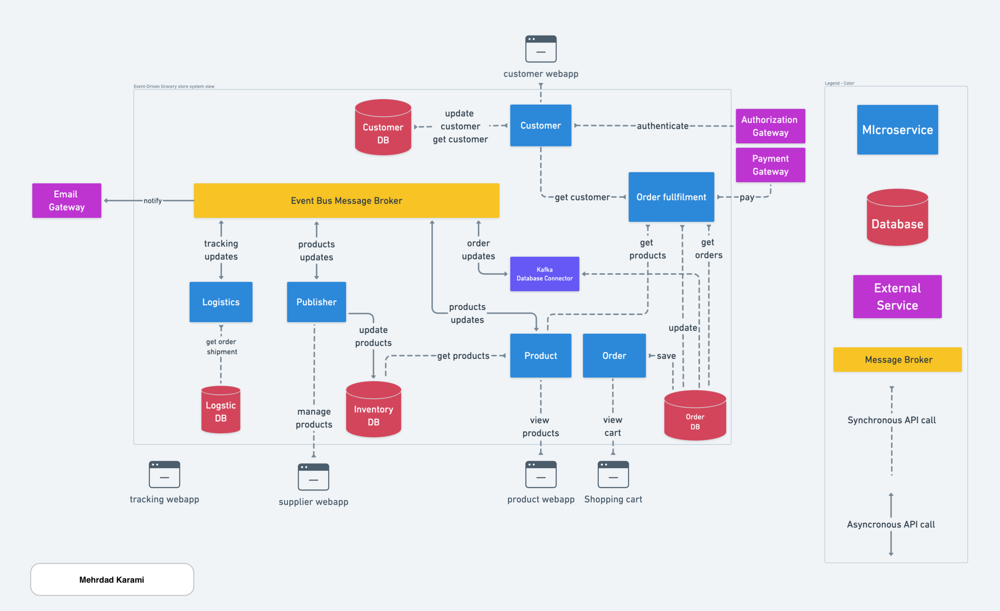
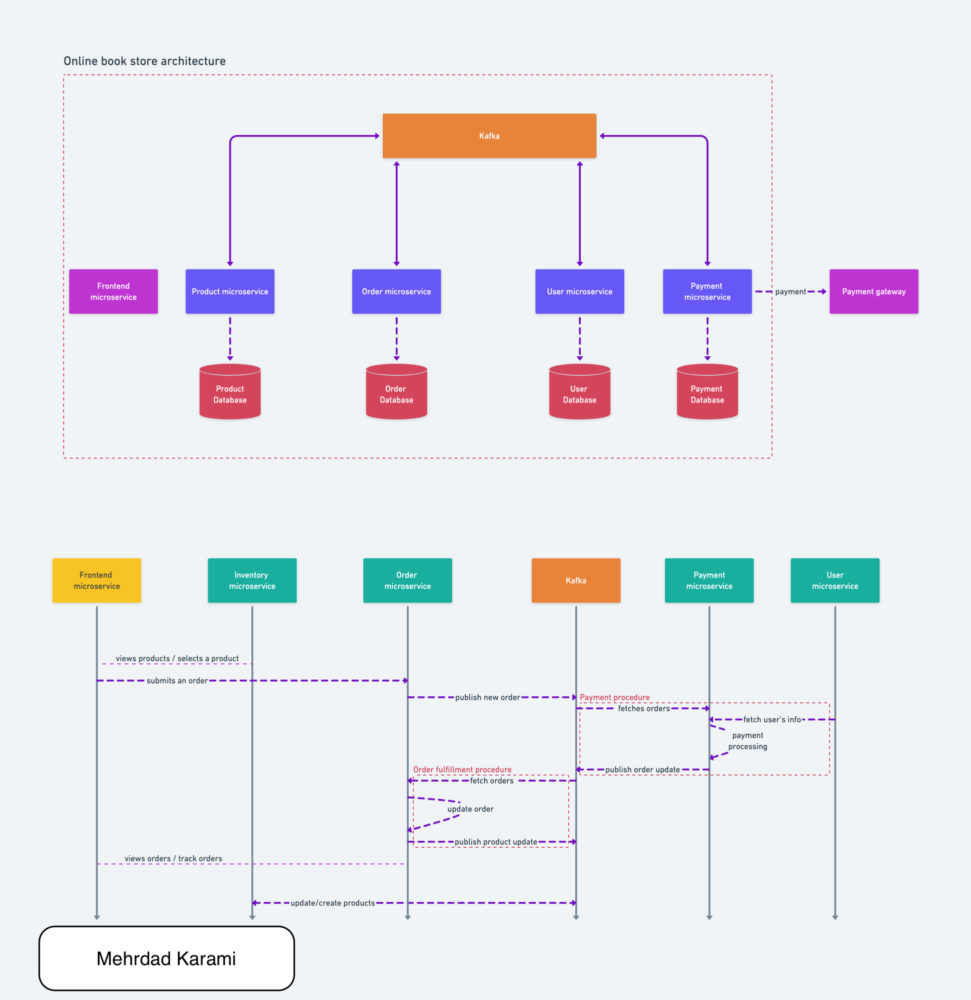

[](https://github.com/metao1/microservice-online-store/actions/workflows/gradle.yml)

# Microservice Online Shop, a modern E-commerce book management web application using Event-Driven and microservice architecture

Online Store is a modern E-commerce system for retailing and product management using web application, built using modern tech-stack. It built with Java Spring boot as backend and React as frontend over a Microservice and event-driven communicating based-on Apache Kafka.

### Event Storming for understanding the system


### Online Shop overall architecture


----------------------------------------------------------------

### component diagram and sequence diagram - microservices rely on event-driven architecture



----------------------------------------------------------------

### Components

We have several microservices as components of online shop system, each of which is located under its directory in the project.

#### 1. Order Microservice:

Responsible to manage orders

- Order fulfillment:
    - Is a component inside the order microservice

#### 2. Inventory or Product Microservice:

Responsible to managing our products in inventory.

#### 3. Payment Microservice: [work in progress]

Responsible to manage payments related to orders with communication with the payment gateway.

#### 4. User Microservice: [work in progress]

Manages customer space, such as customer's info credits and addresses.

#### 5. Shared-kernel:

A library that contains shared code for all microservices.

### Building and running backends

Backend applications contains kafka, postgres, and all other applications running on different containers(microservices)

```shell
docker compose up --build order-microservice inventory-microservice
```

### Building and running frontend

Get into frontend directory and run the below command:

```shell
cd frontend && npm install
```

Wait a little bit when finished run the below command. This will open a new browser window for you:

```shell
npm start
```

The application is open in browser on http://localhost:3000

You can now start browsing products and purchasing some of them. If you like you can add new product as
from 1500 categories. Then in checkout you can finish your orders and get a confirmation number to track your purchases.

### Online Store after frontend runs, screenshot


