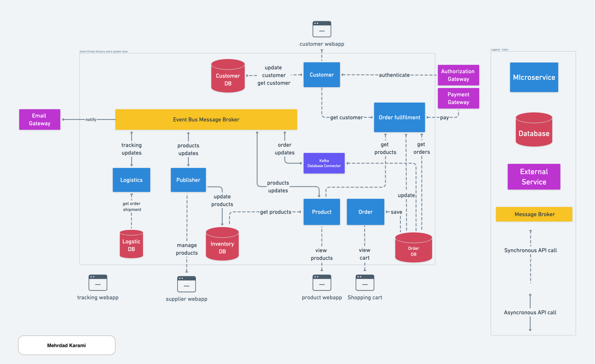

[](https://github.com/metao1/microservice-online-book-store/actions/workflows/gradle.yml)
# Online Book Store, a modern E-commerce book management web application

Online Book Store is a modern E-commerce book management web application, that is built with modern tech-stacks and advanced features. It built with Java Spring boot as backend and React as frontend over a Microservice and event-driven architecture based-on Apache Kafka.



### Microservice architecture
We have several microservices, each of which in located under its directory.
1. #### Order Microservice:
Responsible to manage orders
2. #### Product - Inventory Microservice: [work in progress]
Responsible to manage inventory, here available books.
3. #### Logistics: [work in progress]
Responsible to manage delivering physical books to customers, here available books.
4. #### Order fulfillment: [work in progress]
Is a component inside the order microservice
5. #### Customer: [work in progress]
Manages customer space, such as customer's info  credits and addresses.


### Building and running backends

Backend applications contains kafka, postgres, and all other applications running on different containers(microservices)  

```shell
docker compose up --build order-microservice
```

### Building and running frontend
Get into frontend directory and run the below command:

```shell
cd frontend && npm install
```

Wait a little bit when finished run the below command. This will open a new browser window for you:

```shell
npm start
```

The application is open in browser on http://localhost:3000

You can now start browsing products and purchasing some of them. If you like you can add new product as
from 1500 categories. Then in checkout you can finish your orders and get a confirmation number to track your purchases.


### Bookstore after frontend runs, screenshot


